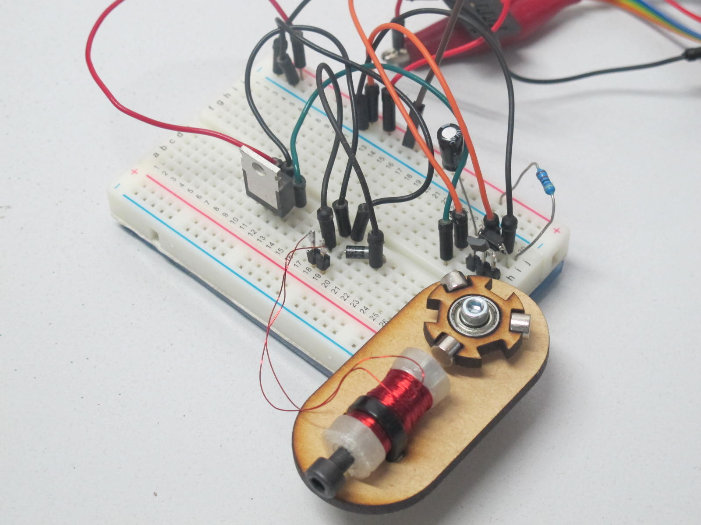
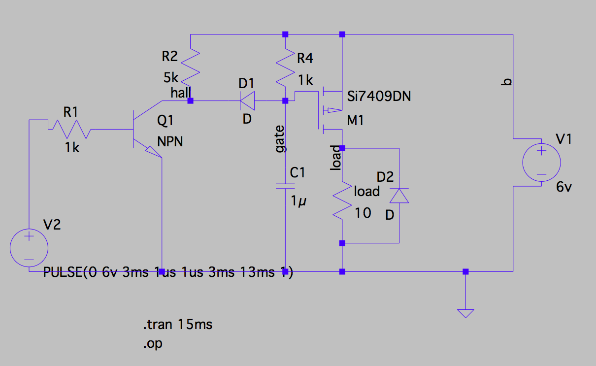

# simple brushless motor

a cheap (<£10) and simple educational brushless motor, allowing adjustment of:

* number of magnets
* coil size and clearance
* sensor phase angle
* coil power timing

# BOM

## electrical

* P channel mosfet - capable of switching at least 1A
* Hall effect sensor
* copper wire for the coil - I used about 8m of 0.224mm copper wire, with an overall resistance of 3.8 Ohms 
* 2 1n4001 diodes
* 5k resistor
* 10 uF cap
* 10k potentiometer

## mechanical

* 10mm miniature bearing
* prototyping board
* [3d printed bobbin](4mm-bolt_motor2 v16_coil_1_Body1.stl) 
* laser cut [rotor](rotor.dxf), [coil mount](mount.dxf) & [base plate](baseplate.dxf)
* magnets - I used 5mm cylindrical

# Links

* [fusion360 motor model](http://a360.co/1SrSSEC)
* [Walter Lewin's physics lectures](https://www.youtube.com/playlist?list=PLyQSN7X0ro2314mKyUiOILaOC2hk6Pc3j)
* [lt spice](http://www.linear.com/designtools/software/)
